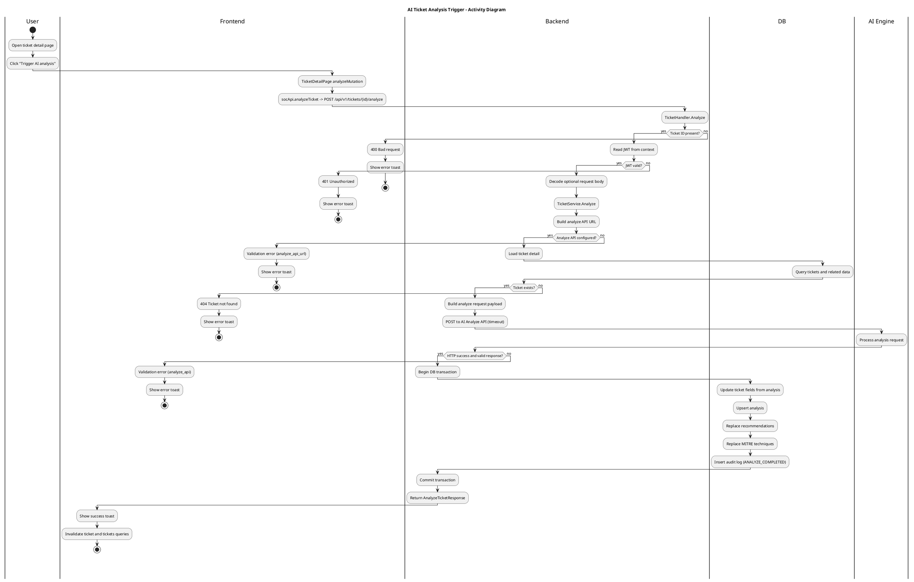

# AI Analysis Trigger Activity Diagram

This diagram covers the AI analysis trigger flow across frontend and backend services.

Sources:
- Backend: internal/handler/http/ticket.go, internal/service/ticket/service.go
- Frontend: src/pages/TicketDetailPage.tsx, src/api/soc.ts, src/lib/api.ts
