# Database Class Diagram

This diagram models the database schema from the migrations.

```plantuml
@startuml
title Database Class Diagram
skinparam classAttributeIconSize 0

class users <<table>> {
  +id: UUID
  +full_name: VARCHAR(100)
  +username: VARCHAR(50)
  +password_hash: VARCHAR(255)
  +role: VARCHAR(20)
  +created_at: TIMESTAMPTZ
  --
  +Create(full_name: VARCHAR, username: VARCHAR, password_hash: VARCHAR, role: VARCHAR): UUID
  +List(): User[]
  +GetByUsername(username: VARCHAR): User
  +GetByID(id: UUID): User
  +UpdatePasswordHash(id: UUID, password_hash: VARCHAR): void
  +AdminUpdate(id: UUID, full_name: VARCHAR?, username: VARCHAR?, role: VARCHAR?, password_hash: VARCHAR?): void
  +DeleteByID(id: UUID): void
}

class user_sessions <<table>> {
  +id: UUID
  +user_id: UUID
  +refresh_token: VARCHAR(255)
  +user_agent: TEXT
  +ip_address: VARCHAR(45)
  +is_revoked: BOOLEAN
  +expires_at: TIMESTAMPTZ
  +created_at: TIMESTAMPTZ
  --
  +Create(user_id: UUID, refresh_token: VARCHAR, user_agent: TEXT?, ip_address: VARCHAR?, expires_at: TIMESTAMPTZ): UUID
  +GetByID(id: UUID): Session
  +GetByRefreshToken(token: VARCHAR): Session
  +ListByUserID(user_id: UUID): Session[]
  +RevokeByRefreshToken(token: VARCHAR): void
  +RevokeByUserID(user_id: UUID): INT
  +RevokeByIDAndUserID(session_id: UUID, user_id: UUID): INT
}

class ticket_ingest_windows <<table>> {
  +id: UUID
  +source_ip: VARCHAR(45)
  +attack_rule_id: VARCHAR(100)
  +threat_category: VARCHAR(100)
  +threat_type: VARCHAR(100)
  +severity: VARCHAR(20)
  +sample_score: INT
  +first_seen: TIMESTAMPTZ
  +last_seen: TIMESTAMPTZ
  +raw_log_count: INT
  +window_seconds: INT
  +window_expires_at: TIMESTAMPTZ
  +payload_first: JSONB
  +payload_last: JSONB
  +payload_sample: JSONB
  +created_at: TIMESTAMPTZ
  +updated_at: TIMESTAMPTZ
  --
  +GetWindowForUpdate(source_ip: VARCHAR, attack_rule_id: VARCHAR): IngestWindow?
  +CreateWindow(input: CreateWindowInput): UUID
  +UpdateWindow(input: UpdateWindowInput): void
  +ListDueWindowsForUpdate(now: TIMESTAMPTZ): IngestWindow[]
  +DeleteWindow(window_id: UUID): void
  +CountActiveWindows(): INT
  +CreateTicketFromWindow(input: CreateTicketFromWindowInput): UUID
}

class ticket_ingest_window_logs <<table>> {
  +id: UUID
  +window_id: UUID
  +wazuh_event_id: VARCHAR(100)?
  +source_ip: VARCHAR(45)
  +attack_rule_id: VARCHAR(100)
  +event_timestamp: TIMESTAMPTZ
  +raw_payload: JSONB
  +created_at: TIMESTAMPTZ
  --
  +InsertWindowLog(input: InsertWindowLogInput): void
  +ListWindowLogPayloads(window_id: UUID): JSONB[]
}

class tickets <<table>> {
  +id: UUID
  +ticket_number: VARCHAR(32)
  +source_ip: VARCHAR(45)
  +attack_rule_id: VARCHAR(100)
  +threat_category: VARCHAR(100)
  +threat_type: VARCHAR(100)
  +severity: VARCHAR(20)
  +status: VARCHAR(20)
  +assignee_id: UUID?
  +first_seen: TIMESTAMPTZ
  +last_seen: TIMESTAMPTZ
  +raw_log_count: INT
  +payload_first: JSONB
  +payload_last: JSONB
  +payload_sample: JSONB
  +created_at: TIMESTAMPTZ
  +updated_at: TIMESTAMPTZ
  --
  +Count(q: ListTicketsQuery): BIGINT
  +List(q: ListTicketsQuery, limit: INT, offset: INT): Ticket[]
  +GetByID(id: UUID): Ticket
  +GetByIDForUpdate(id: UUID): Ticket
  +GetDetail(id: UUID): TicketDetail
  +UpdateStatus(id: UUID, status: VARCHAR, assignee_id: UUID?): void
  +UpdateFromAnalysis(id: UUID, severity: VARCHAR?, threat_category: VARCHAR?, threat_type: VARCHAR?, status: VARCHAR?): void
}

class ticket_daily_counters <<table>> {
  +ticket_date: DATE
  +seq: BIGINT
  --
  +NextSequence(ticket_date: DATE): BIGINT
}

class ticket_raw_logs <<table>> {
  +id: UUID
  +ticket_id: UUID
  +wazuh_event_id: VARCHAR(100)?
  +source_ip: VARCHAR(45)
  +attack_rule_id: VARCHAR(100)
  +event_timestamp: TIMESTAMPTZ
  +raw_payload: JSONB
  +created_at: TIMESTAMPTZ
  --
  +UpsertRawLog(ticket_id: UUID, raw_payload: JSONB): void
  +ListByTicketID(ticket_id: UUID): RawLog[]
  +MoveWindowLogsToTicket(window_id: UUID, ticket_id: UUID): BIGINT
}

class ticket_analyses <<table>> {
  +id: UUID
  +ticket_id: UUID
  +model_name: VARCHAR(100)
  +summary: TEXT
  +detailed_analysis: TEXT
  +attack_vector: TEXT
  +potential_impact: TEXT
  +confidence_score: DECIMAL(3,2)
  +processing_time_ms: DECIMAL(12,4)
  +created_at: TIMESTAMPTZ
  --
  +UpsertAnalysis(ticket_id: UUID, model_name: VARCHAR, created_at: TIMESTAMPTZ): UUID
  +GetByTicketID(ticket_id: UUID): Analysis?
}

class ticket_recommendations <<table>> {
  +id: UUID
  +analysis_id: UUID
  +priority: SMALLINT
  +action: TEXT
  +reason: TEXT
  +created_at: TIMESTAMPTZ
  --
  +ReplaceRecommendations(analysis_id: UUID, recs: Recommendation[]): void
  +ListByAnalysisID(analysis_id: UUID): Recommendation[]
}

class ticket_iocs <<table>> {
  +id: UUID
  +ticket_id: UUID
  +ioc_type: VARCHAR(50)
  +ioc_value: TEXT
  +created_at: TIMESTAMPTZ
  --
  +ReplaceIOCs(ticket_id: UUID, iocs: IOC[]): void
  +ReplaceMitreTechniques(ticket_id: UUID, techniques: VARCHAR[]): void
  +ListByTicketID(ticket_id: UUID): IOC[]
}

class notifications <<table>> {
  +id: UUID
  +user_id: UUID
  +ticket_id: UUID?
  +message: TEXT
  +is_read: BOOLEAN
  +created_at: TIMESTAMPTZ
  --
  +CountByUser(user_id: UUID, is_read: BOOLEAN?): BIGINT
  +ListByUser(user_id: UUID, limit: INT, offset: INT, is_read: BOOLEAN?): Notification[]
  +MarkRead(user_id: UUID, notification_id: UUID): void
  +CreateForAllUsers(ticket_id: UUID?, message: TEXT): Notification[]
}

class ticket_logs <<table>> {
  +id: UUID
  +ticket_id: UUID
  +user_id: UUID?
  +action: VARCHAR(50)
  +note: TEXT
  +created_at: TIMESTAMPTZ
  --
  +Create(ticket_id: UUID, user_id: UUID?, action: VARCHAR, note: TEXT?): void
  +ListByTicketID(ticket_id: UUID): TicketLog[]
  +ListByUserID(user_id: UUID): TicketLog[]
  +GetLastStatusUpdatedBy(ticket_id: UUID): UUID?
  +GetUserFullNameAndRoleByID(user_id: UUID): (String, String)
}

users "1" *-- "many" user_sessions : user_id
users "0..1" -- "0..*" tickets : assignee_id
users "1" *-- "0..*" notifications : user_id
users "0..1" -- "0..*" ticket_logs : user_id

tickets "1" *-- "0..*" ticket_raw_logs : ticket_id
tickets "1" *-- "0..1" ticket_analyses : ticket_id
ticket_analyses "1" *-- "0..*" ticket_recommendations : analysis_id
tickets "1" *-- "0..*" ticket_iocs : ticket_id
tickets "1" *-- "0..*" ticket_logs : ticket_id
tickets "0..1" *-- "0..*" notifications : ticket_id

ticket_ingest_windows "1" *-- "0..*" ticket_ingest_window_logs : window_id

note right of notifications
  ticket_id is optional
end note

note right of ticket_daily_counters
  Used for ticket_number generation
end note
@enduml
```

Sources:
- internal/infrastructure/database/postgresql/migrations/000001_initial_schema.up.sql
- internal/infrastructure/database/postgresql/migrations/000002_notifications_optional_ticket_id.up.sql
