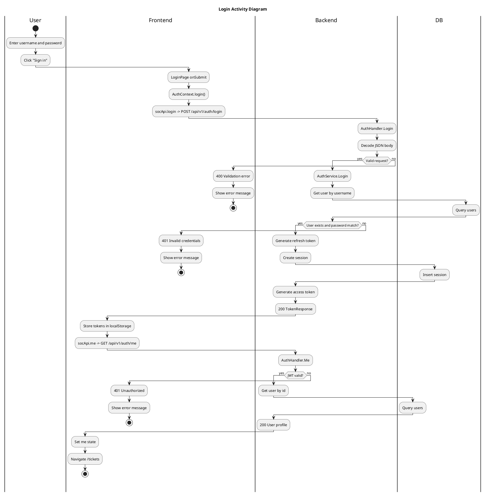

# Login Activity Diagram

This diagram covers the login flow across frontend and backend services.

Sources:
- Backend: internal/handler/http/auth.go, internal/service/auth/service.go, internal/domain/auth/dto.go
- Frontend: src/pages/LoginPage.tsx, src/auth/AuthContext.tsx, src/api/soc.ts, src/lib/api.ts, src/lib/tokens.ts
