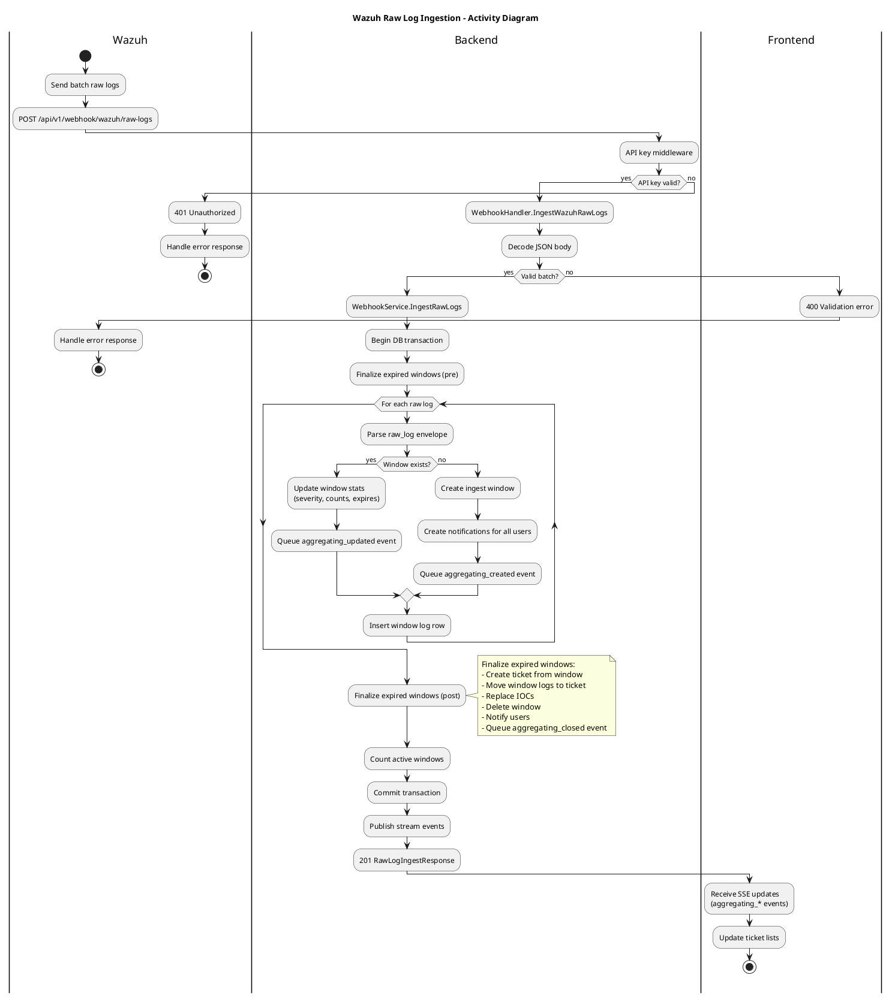

# Wazuh Raw Log Ingestion Activity Diagram

This diagram covers raw log batch ingestion from Wazuh into the backend and the resulting client updates.

Sources:
- Backend: internal/handler/http/webhook.go, internal/service/webhook/service.go
- Repository: internal/repository/postgresql/webhook_wazuh.go
- Frontend: src/hooks/useTicketsStream.ts
